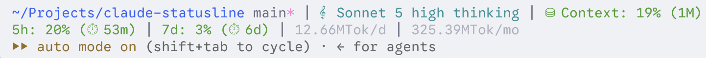
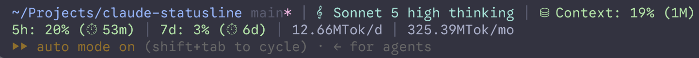

# Claude Code Statusline



My personal statusline script for Claude Code.

## What it shows

| Item | Description |
| --- | --- |
| Directory | Current directory, shortened when it doesn't fit the terminal width |
| Git branch | Current branch, with a `*` marker when the working tree is dirty |
| Model | Model name, plus effort level and thinking indicator |
| Context window | Usage percentage and window size |
| Rate limits | 5-hour and 7-day usage, with time until each resets |
| Tokens | Daily and monthly token totals, when `ccusage` is installed |

## Requirements
- [Claude Code CLI](https://code.claude.com/docs) 2.1.153 or newer
- [Python](https://www.python.org) 3.9 or newer
- [git](https://git-scm.com) 2.11 or newer (optional, for git status)
- [ccusage](https://ccusage.com) (optional, for daily/monthly token stats)

## How it works
1. Claude Code feeds session information as a JSON into the statusline script.
2. Parses the input JSON.
3. Checks the daily/monthly usage if `ccusage` is installed in the system.
4. Checks the git status if the current workspace is git repository.
5. Prints a statusline.

## Installation
### Manual
1. Copy `statusline.py` to `~/.claude/statusline.py`.

2. Set command following settings to `~/.claude/settings.json`:

   ```json
   {
     "statusLine": {
       "type": "command",
       "command": "python3 ~/.claude/statusline.py"
     }
   }
   ```

3. Start a new Claude Code session or restart the current one.
